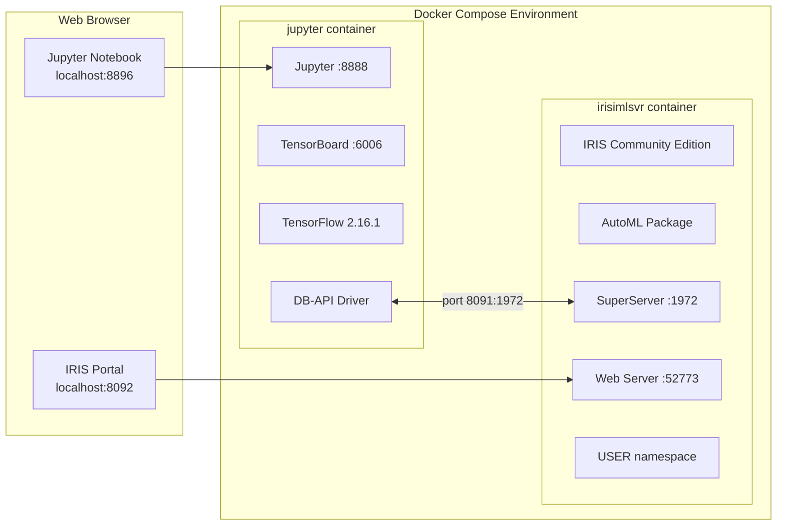

# IntegratedML Demo Template

This is a template for IntegratedML - InterSystems GitHub repository.

This repository comes with example Jupyter notebooks demonstrating how to use IntegratedML in InterSystems IRIS Community Edition in a Docker container.

## Contents
- [What is IntegratedML?](#what-is-integratedml)
- [What's inside this template](#whats-inside-this-template)
- [Pre-configured environment and sample data](#pre-configured-environment-and-sample-data)
  - [Sample notebooks to get you started](#sample-notebooks-to-get-you-started)
  - [Demo environment topology](#demo-environment-topology)
  - [Prerequisites](#prerequisites)
  - [Tested environments](#tested-environments)
  - [Installation](#installation)
- [How to develop your IntegratedML solution](#how-to-develop-your-integratedml-solution-with-the-integratedml-template-repository)
- [How to Import data into InterSystems IRIS](#how-to-import-data-into-intersystems-iris)

## What is IntegratedML?
IntegratedML is a feature of the InterSystems IRIS data platform that brings machine learning to SQL developers.

<p align="center">
  
</p>

IntegratedML is:
- **All-SQL** -- Build and train machine learning models using intuitive custom SQL commands, fully integrated within the InterSystems IRIS SQL processor
- **Turnkey** -- No packages or programming languages to learn, nothing to install
- **Modular** -- Leverages "best of breed" open source and proprietary AutoML frameworks

Learn more about InterSystems IRIS and IntegratedML at the [InterSystems Learning site](https://learning.intersystems.com/course/view.php?name=Learn%20IntegratedML)

## What's inside this template

### Pre-configured environment and sample data
This template creates a Docker environment (via `docker-compose up`) with 2 pre-configured containers:
1. **jupyter**: TensorFlow 2.16.1 + Jupyter notebook server with sample notebooks
2. **irisimlsvr**: InterSystems IRIS Community Edition with AutoML package (installed via Dockerfile) and pre-loaded sample data in USER namespace

### Sample notebooks to get you started
The template includes sample notebook files accessible at http://localhost:8896/tree:

- **[campaign-integratedml.ipynb](jupyter-samples/campaign-integratedml.ipynb)**: A simple connection to sample Marketing Campaign data, demonstrating IntegratedML including VALIDATE MODEL command usage.
- **[readmission-integratedml.ipynb](jupyter-samples/readmission-integratedml.ipynb)**: Demonstrates IntegratedML on a hospital readmission prediction dataset.
- **[biomedical-integratedml.ipynb](jupyter-samples/biomedical-integratedml.ipynb)**: Building and using an IntegratedML model with complex SQL queries using PREDICT() and PROBABILITY() functions.
- **[ED_visit_90_day.ipynb](jupyter-samples/ED_visit_90_day.ipynb)**: Building and using an IntegratedML model to predict Emergency Department visits. *NOTE: This notebook requires external data and is not executable out of the box.*

All notebooks use the **intersystems-irispython** DB-API driver for database connectivity.

## Demo environment topology



**Port Mappings:**
| Host Port | Container Port | Service |
|-----------|----------------|---------|
| 8896 | 8888 | Jupyter Notebook |
| 6026 | 6006 | TensorBoard |
| 8091 | 1972 | IRIS SuperServer (DB-API) |
| 8092 | 52773 | IRIS Web Portal |

## Prerequisites
Make sure you have [git](https://git-scm.com/book/en/v2/Getting-Started-Installing-Git) and [Docker](https://www.docker.com/products/docker-desktop) or [Podman](https://podman.io/) installed.

## Tested environments
This template is tested on AWS Ubuntu, Mac OS, and Windows 10. It should work on other Docker environments too - let us know if you encounter any issues.

## Installation

1. Clone the repository:
```bash
git clone https://github.com/intersystems-community/integratedml-demo-template.git
cd integratedml-demo-template
```

2. Build the Docker images:
```bash
docker-compose build
```

3. Run the containers:
```bash
docker-compose up -d
```

4. Access the Jupyter notebooks:
```
http://localhost:8896/tree
```

5. Access the IRIS Management Portal / Web Terminal:
```
http://localhost:8092/terminal/
```
Credentials: SuperUser / SYS

Enter `/sql` mode to make SQL queries and examine data in IRIS.


## How to develop your IntegratedML solution with the IntegratedML Template Repository

### Use this template
Click the button "Use this template" on GitHub to create a new repository which will be a copy of this one.

### Checkout the repo
Clone your new repo to a local folder.

### Start developing
Install [VSCode](https://code.visualstudio.com/) with the [Docker extension](https://marketplace.visualstudio.com/items?itemName=ms-azuretools.vscode-docker) and [ObjectScript extension](https://marketplace.visualstudio.com/items?itemName=daimor.vscode-objectscript), then open the folder in VSCode.

Import your data as listed below, rebuild containers to let the data be imported, and use IntegratedML via SQL tools, as described in Jupyter notebooks.

## How to Import data into InterSystems IRIS

### Importing data from CSV file
1. Add a CSV file into the repository, e.g., like [titanic.csv](iris-aa-server/data/titanic.csv)
2. Add an import data call to your IRIS initialization script ([example](iris-aa-server/iris.script))
3. Query the data from any SQL tool, web terminal, or from InterSystems ObjectScript:
```sql
SELECT * FROM Titanic.Passenger
```

### Importing data from CSV URL
If your file is accessible remotely, you can import it as follows:
1. Add the import CSV from URL line to [iris.script](iris-aa-server/iris.script)
2. Rebuild the Docker image: `docker-compose build`
3. Query the imported data:
```sql
SELECT * FROM SQLUser.Countries
```

## Troubleshooting

### IRIS Community Edition Core Limit Error

If you see the error:
```
Error: Invalid Community Edition license, may have exceeded core limit.
```

This typically occurs with **outdated Docker images**. The older `intersystemsdc/iris-ml-community` images on Docker Hub have **expired licenses** and should not be used.

**Solution:** This template uses the regularly updated `intersystemsdc/iris-community:latest-em-zpm` image which includes ZPM (InterSystems Package Manager) and has a valid license supporting up to 20 CPU cores.

## Technology Stack
- **InterSystems IRIS Community Edition** with ZPM (supports up to 20 cores)
- **TensorFlow 2.16.1** with Jupyter
- **Python** with intersystems-irispython DB-API driver
- **AutoML** (intersystems-iris-automl) installed via pip

## Changes in 2025 Update
- Updated TensorFlow from 2.2.0 to 2.16.1
- Switched from JDBC/PyODBC to DB-API driver (intersystems-irispython)
- Switched to `intersystemsdc/iris-community:latest-em-zpm` (regularly updated, includes ZPM)
- Modernized docker-compose configuration
- Added GitHub Actions CI/CD workflow
- Updated all Python dependencies with version pinning
- Multi-architecture support (ARM64 for Apple Silicon, AMD64 for Intel)
